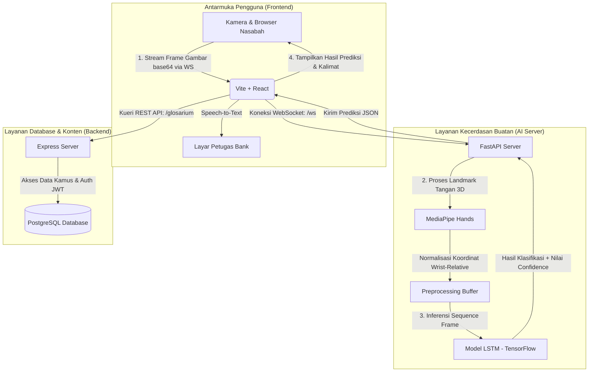

<p align="center">
  
</p>

<h1 align="center">Financial Sign Language (Signbank-AI)</h1>

<p align="center">
  <strong>Solusi Kecerdasan Buatan Terintegrasi untuk Penerjemahan Bahasa Isyarat Sektor Keuangan</strong><br />
  <em>Capstone Project Bangkit Academy — Tim CC26-PSU273</em>
</p>

<p align="center">
  <a href="#tentang-proyek">Tentang Proyek</a> •
  <a href="#fitur-utama">Fitur Utama</a> •
  <a href="#arsitektur-sistem--aliran-data">Arsitektur</a> •
  <a href="#struktur-repositori">Struktur Repositori</a> •
  <a href="#petunjuk-menjalankan-proyek">Petunjuk Menjalankan</a> •
  <a href="#teknologi-yang-digunakan">Teknologi</a> •
  <a href="#anggota-tim-cc26-psu273">Anggota Tim</a>
</p>

---

## Tentang Proyek

Akses ke layanan perbankan dan keuangan merupakan hak dasar bagi semua orang, termasuk komunitas Tuli. Namun, kendala komunikasi antara petugas bank (teller/customer service) dan nasabah Tuli sering kali menjadi hambatan utama dalam menciptakan layanan keuangan yang inklusif. Istilah-istilah keuangan seperti "setoran awal", "rekening koran", "transfer", atau "suku bunga" memiliki visualisasi gerakan isyarat yang spesifik dan jarang dipahami oleh masyarakat umum.

**Signbank-AI** hadir sebagai solusi jembatan komunikasi interaktif dua arah yang memanfaatkan teknologi kecerdasan buatan (AI). Proyek ini dirancang untuk menerjemahkan bahasa isyarat (Sign-to-Text) terkait istilah keuangan secara langsung menggunakan kamera web, serta menerjemahkan ucapan petugas bank menjadi teks (Speech-to-Text) untuk dibaca oleh nasabah Tuli.

---

## Fitur Utama

1. **Penerjemah Isyarat Real-Time (Sign-to-Text)**:
   - Menggunakan model *Long Short-Term Memory* (LSTM) untuk mengenali urutan gerakan tangan (gestur dinamis).
   - Ekstraksi koordinat tangan (*hand landmarks*) secara *real-time* menggunakan **MediaPipe Hands**.
   - Komunikasi data berkecepatan tinggi berbasis **WebSocket** untuk pengiriman frame video dan penerimaan teks terjemahan tanpa jeda (lag).

2. **Pengenalan Ucapan Petugas (Speech-to-Text)**:
   - Memungkinkan petugas bank memberikan penjelasan verbal yang langsung dikonversi menjadi teks pada layar nasabah.
   - Menggunakan Web Speech API dengan dukungan bahasa Indonesia yang akurat.

3. **Kamus Istilah Keuangan (Financial Glossary)**:
   - Katalog istilah keuangan lengkap dengan kategori (Perbankan, Investasi, Administrasi, dll.).
   - Dilengkapi demonstrasi video gerakan isyarat, definisi istilah, dan contoh penggunaannya.

4. **Dashboard Admin Terintegrasi**:
   - Fitur bagi administrator untuk menambah, mengubah, atau menghapus data kamus istilah keuangan.
   - Upload berkas media (video/gambar peraga) yang didukung oleh antarmuka interaktif FilePond.

---

## Arsitektur Sistem & Aliran Data

Aplikasi ini menggunakan model arsitektur terdistribusi yang membagi beban kerja ke dalam tiga layanan utama: Frontend (React), Backend (Express & PostgreSQL), dan Server AI (FastAPI & TensorFlow).



---

## Struktur Repositori

Proyek ini terorganisasi ke dalam tiga folder utama:

*   **[ai](file:///d:/Kuliah/Dicoding/Capstone/Project/Financial%20Sign%20Language/ai)**: Menyediakan model deteksi dan WebSocket API untuk inferensi *deep learning* gerakan isyarat.
*   **[backend](file:///d:/Kuliah/Dicoding/Capstone/Project/Financial%20Sign%20Language/backend)**: Mengelola manajemen basis data, autentikasi admin (JWT & bcrypt), serta *routing* data kamus istilah keuangan.
*   **[frontend](file:///d:/Kuliah/Dicoding/Capstone/Project/Financial%20Sign%20Language/frontend)**: Aplikasi web *single-page* (SPA) interaktif untuk nasabah dan petugas bank.

---

## Petunjuk Menjalankan Proyek

### 1. Prasyarat (Prerequisites)
Sebelum menjalankan proyek di lingkungan lokal, pastikan Anda telah menginstal:
*   [Node.js](https://nodejs.org/) (Versi 18 ke atas)
*   [Python](https://www.python.org/) (Versi 3.9 hingga 3.11 direkomendasikan)
*   [PostgreSQL](https://www.postgresql.org/) (Server aktif dengan database kosong bernama `signbank`)

---

### 2. Konfigurasi Lingkungan (Environment Variables)

#### Backend Configuration
Buat file bernama `.env` di dalam folder `backend/` dan sesuaikan nilainya:
```env
HOST=localhost
PORT=3000

PGUSER=postgres
PGHOST=localhost
PGPASSWORD=password_postgresql_anda
PGDATABASE=signbank
PGPORT=5432

ACCESS_TOKEN_KEY=string_rahasia_jwt_anda
REFRESH_TOKEN_KEY=string_rahasia_refresh_jwt_anda
ACCESS_TOKEN_AGE=24h
AI_WS_URL=ws://127.0.0.1:8000/ws
```

#### Frontend Configuration
Buat file bernama `.env` di dalam folder `frontend/` dan sesuaikan alamat WebSocket AI:
```env
VITE_WS_URL=ws://127.0.0.1:8000/ws
```

---

### 3. Langkah-Langkah Menjalankan (Lokal)

Jalankan masing-masing komponen di jendela terminal terpisah:

#### A. Menjalankan Layanan AI
```bash
# Masuk ke folder AI
cd ai

# Membuat virtual environment Python
python -m venv .venv

# Mengaktifkan virtual environment
# Windows (PowerShell):
.venv\Scripts\activate
# Linux/macOS:
source .venv/bin/activate

# Menginstal dependensi pustaka Python
pip install -r requirements.txt

# Menjalankan server FastAPI
python app.py
```
*Layanan AI akan berjalan secara lokal di [http://localhost:8000](http://localhost:8000).*

#### B. Menjalankan Layanan Backend
```bash
# Masuk ke folder backend
cd backend

# Menginstal modul Node.js
npm install

# Menjalankan migrasi tabel database PostgreSQL
npm run migrate up

# Menjalankan server backend Express
npm run start:dev
```
*Layanan backend REST API akan berjalan di [http://localhost:3000](http://localhost:3000).*

#### C. Menjalankan Layanan Frontend
```bash
# Masuk ke folder frontend
cd frontend

# Menginstal dependensi frontend
npm install

# Menjalankan server pengembangan Vite
npm run dev
```
*Aplikasi frontend dapat diakses melalui browser di [http://localhost:5173](http://localhost:5173).*

---

## Teknologi yang Digunakan

| Komponen | Teknologi Utama |
| :--- | :--- |
| **Artificial Intelligence** | Python, FastAPI, TensorFlow (Keras), MediaPipe Hands, NumPy, OpenCV, Joblib |
| **Backend & Database** | Node.js, Express, PostgreSQL, node-pg-migrate, JWT (jsonwebtoken), Bcrypt |
| **Frontend UI** | React, Vite, Tailwind CSS, React Router, FilePond, Speech Recognition API, SweetAlert2 |

---

## Anggota Tim (CC26-PSU273)

Kami adalah tim pengembang yang berkomitmen untuk mewujudkan inklusi keuangan bagi penyandang disabilitas rungu melalui kolaborasi multidisiplin:

*   **Reza Prasetiyo Syahputra** (Fullstack Developer) — Bertanggung jawab pada pengembangan frontend, UI/UX translator, kamus interaktif UI frontend.
*   **Saputra** (Fullstack Developer) — bertanggung jawab pada pengembangan backend, integrasi database, keamanan API, dan integrasiAPI.
*   **Andika Putra Perdana** (AI Engineer) — Bertanggung jawab pada perancangan arsitektur model LSTM, pemrosesan koordinat MediaPipe, dan optimasi WebSocket.
*   **Adi Pratama** (AI Engineer) — Bertanggung jawab pada pengumpulan data latih, pelatihan model LSTM, evaluasi model, dan integrasi API FastAPI.
*   **Wahyu Nurhabib** (Data Science) — Bertanggung jawab pada rekayasa fitur data landmark, analisis dataset, pembersihan data gestur, dan penyelarasan label encoder.
*   **Louie Jason Firmansyah** (Data Science) — Bertanggung jawab pada penyusunan dataset video, anotasi video gerakan isyarat keuangan, dan visualisasi distribusi data.

---
<p align="center">
  Dibuat dengan ❤️ oleh Tim CC26-PSU273 untuk Komunitas Tuli Indonesia yang Mandiri Finansial.
</p>
